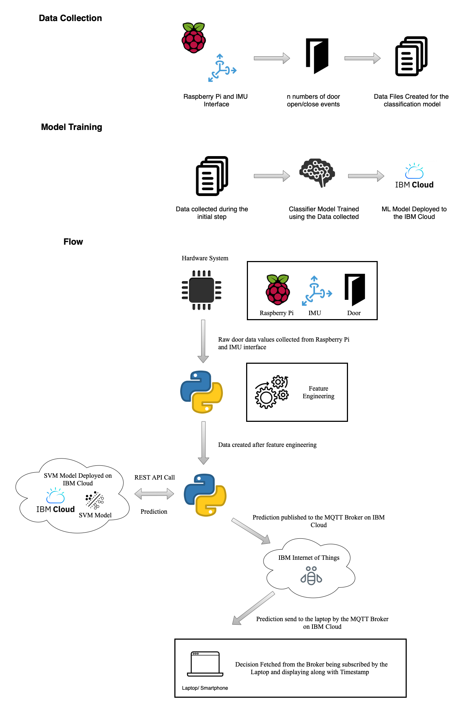

# Door Movement Detection

The primary goal of the project is to gain hands-on experience working with analytics tools and cloud platforms while using real sensors. In this project, we created an inertial measurement unit (IMU) and a cloud-based machine learning system to detect door open and close events. We mounted the IMU sensor to a door and used IMU readings to identify when it was closed and opened.

# Overview of the System Flow

1.	We connect the Raspberry Pi and Laptop to the MQTT broker provided by IBM cloud 
2.	After establishing connection to MQTT  broker, when we open/close the door, we detect an open/close sequence using the logic mentioned in the section 4
3.	We then create features required for the SVM, and call the REST  API for the model deployed on IBM cloud with feature vector as payload
4.	Upon receiving the prediction as a response from the REST API, we publish the result to the MQTT broker on the topic “DoorStatus”
5.	The Laptop is subscribed to the topic “DoorStatus” so whenever a prediction is published on the topic is received by  Laptop and we print the door status with timestamp on the Laptop

<h1 align="center">
    
</h1>

## Environment
- Python 3.7.3

## Requirements
### Software
- Python3 3.7.3
- paho-mqtt v1.6.1
- numpy v1.19.5
- mosquitto 
- wiotp-sdk
- requests
- RPi.GPIO
- python3-smbus
- mpu6050-raspberrypi

```
pip install paho-mqtt
pip install RPi.GPIO
pip3 install wiotp-sdk
brew install mosquitto
apt install python3-smbus
pip install mpu6050-raspberrypi

```

### Hardware

-Raspberry Pi model 3B<br />
-MPU6050 accelerometer & gyro

To setup the hardware, connect the following raspberry pi GPIO pins to the corresponding MPU pins.

GPIO 2 to SDA, <br />
GPIO 3 to SCL, <br />
5V to VCC, <br />
GND to GND <br />

## Data Collection

For the collection of the data, the code present in the `Data_Collection` folder was used to collect the data and the respective data was saved in a .txt file.

## Classification Model

For the prediction of the door status we have used the SVM model and deployed it to the IBM cloud. To which the IBM Cloud provides us the RESP API request on which the result can be requested by calling the API by passing the required data and calling the API.

The Complete procedure for the model implementation and deployment can be found under the `Model Implementation and Deployment` folder. In the folder there is a .ipynb file which consists of all the Model implementation and deployment.

## Procedure
For the execution of each code file, the  a detailed README.md file explaining how to execute the code is available in the respective folder of that device.

IMU : [IMU](./IMU)

Laptop : [Laptop](./Laptop)
